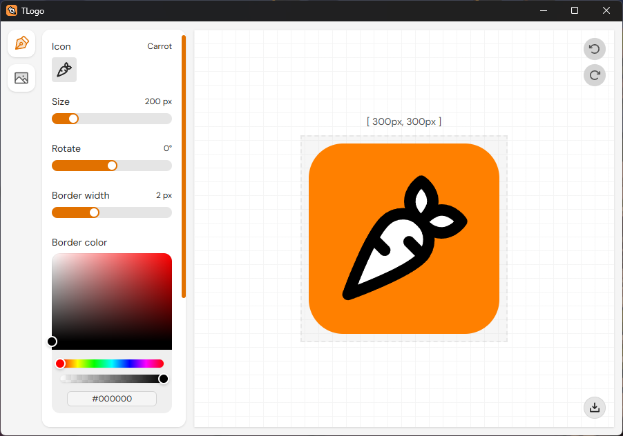

<h1 align="center">
    <br>
    
    <br>
    TLogo
</h1>

<h4 align="center">Simple logo creator based on <a href="https://lucide.dev/">Lucide Icons</a></h4>



## How To Use

If you don't already have it download [pnpm](https://pnpm.io/) first

```bash
# Clone this repository
$ git clone https://github.com/fraater/tlogo

# Go into the repository
$ cd tlogo

# Install dependencies
$ pnpm install

# Run the app
$ pnpm tauri dev
```

## Installation

```bash
# Create an installer
$ pnpm tauri build
```

## Tech Stack


---

> Inspired by [LogoFast](https://shipfa.st/tools/logo-fast)
